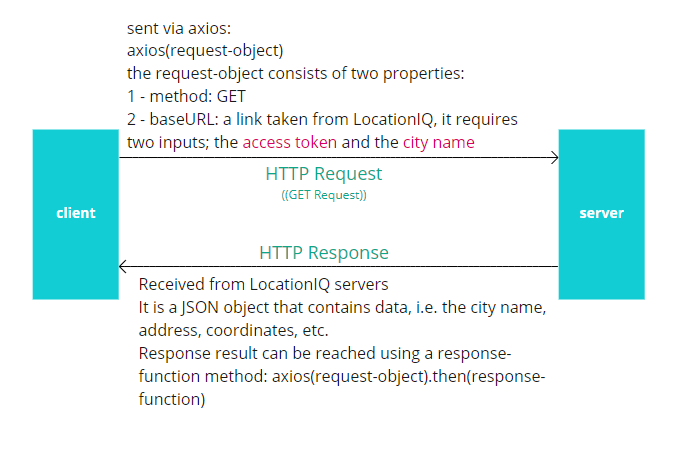

# City Explorer

**Author**: Hasnaa Al-Habahbeh
**Version**: 1.0.5

## Overview

This application allows users to find the location of a city for a city of their choice. When users chooses a city and clicks explore button, they will be provided with:

1. The name, address, latitude and longitude coordinates of the city.
2. A static map of the city with a cutout.

## Getting Started

### Steps for implementing Feature .1 - Location Explore

1. Sign-up to LocationIQ API.
2. Store the access token you got by signing up to LocationIQ in an .env file.
3. Create two components: a search form component and a location component. In the *search form* component, create a form that contains a text type input for the city name and a submit button. In the *location component*, create the elements you want to display the results in.
4. In App.js component, do the following:
    1. initialize the state.
    2. create a `handleLocation` method to store the user's inputted city name, this method should be passed to the search form component and used as an `onChange` callback for the text input form control.
    3. create a `handleSubmit` method to create a request from the API, this method contains the following:
        1. An object that specifies the request type (method property) and endpoint (baseURL property).
        2. Pass that object to the **axios** method to make a GET request to the LocationIQ API. Since this is an asynchronous function, we will use `.then()` and a callback to get back all of the response data.
        This callback takes one parameter which will be having the response. You can check it using `console.log(res)` and `console.log(res.data)`.
        3. Set the state with the new values retrieved by the GET request.
    The `handleSubmit` will be passed the search form component and used as an `onSubmit` callback in the form tag.
    4. create a `handleSubmit` method to clear the screen. This method should be passed to the search form component and used as an `onClick` callback for the clear button.

#### WRRC

### Steps for implementing Feature .2 - Location Map

1. In the location component, add a Bootstrap image component of your choice.
2. The source of the map's image will be: `https://maps.locationiq.com/v3/staticmap?key=${process.env.REACT_APP_LOCATION_API_KEY}&size=600x600&zoom=14&markers=${this.props.lat},${this.props.lon}|icon:large-black-cutout&format=png`

### Steps for implementing Feature .3 - Alert Errors

1. Create a new component named ErrorMessage and add an alert bootstrap component in it.
2. In App.js component, add new properties to the status: error code, error message, error alert flag.
3. Catch the response errors: `axios(config).then(res => {FUNCTION}).catch(error => {FUNCTION}`.
    You can reach the response error using `error.response`, response error data using `error.response.data`.
    Set the state to these new error value.
4. Pass the new state values to ErrorMessage as props and use them there.

## Architecture

* React
* React Bootstrap
* CSS
* LocationIQ API
* Axios

## Change Log

12-09-2021 04:30pm - Application now has a location explore functionality, with a GET route for the location resource.
12-09-2021 07:20pm - Application now can show map of the requested location.
12-09-2021 08:00pm - Application now can alert for errors.
13-09-2021 09:00pm - Application now can show weather info for certain locations.
14-09-2021 10:30pm - Application now can show weather info for all locations and movies for the city name.

## Credit and Collaborations
<!-- Give credit (and a link) to other people or resources that helped you build this application. -->

## Features

### Feature .1 - Location Explore

Estimate of time needed to complete: 2 hours
Start time: 2:45 pm
Finish time: 4:30 pm
Actual time needed to complete: 1 hour and 45 minutes

### Feature .2 - Add Map

Estimate of time needed to complete: 1 hour
Start time: 6:30 pm
Finish time: 7:20 pm
Actual time needed to complete: 50 minutes

### Feature .3 - Add Errors Alert

Estimate of time needed to complete: 1 hour
Start time: 7:30 pm
Finish time: 8:00 pm
Actual time needed to complete: 30 minutes

### Feature .4 - Location Weather API

Estimate of time needed to complete: 1 hour
Start time: 7:30 pm
Finish time: 9:00 pm
Actual time needed to complete: 90 minutes

### Feature .5 - Location Weather Bit API and MoviedB API

Estimate of time needed to complete: 1 hour
Start time: 9 pm
Finish time: 10:15 pm
Actual time needed to complete: 1:15 hour

### Refactoring the Code to Componentize the Front-end Codebase

Estimate of time needed to complete: 30 minutes
Start time: 3:50 pm
Finish time: 4:15 pm
Actual time needed to complete: 25 minutes
